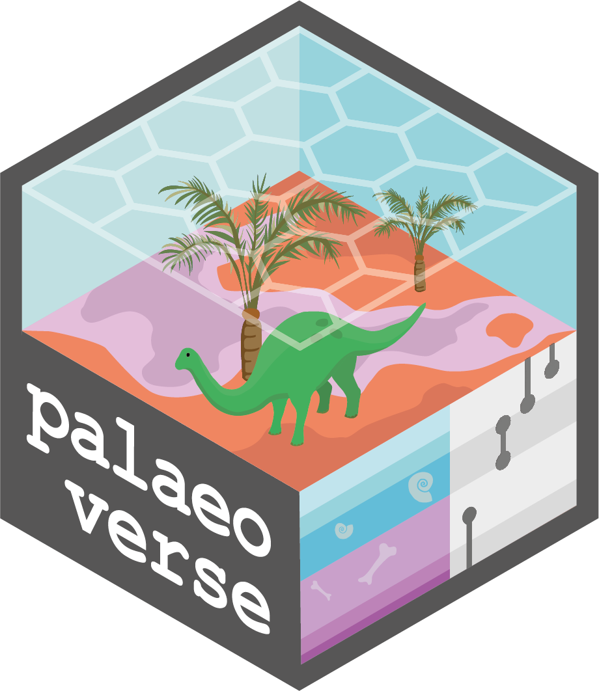
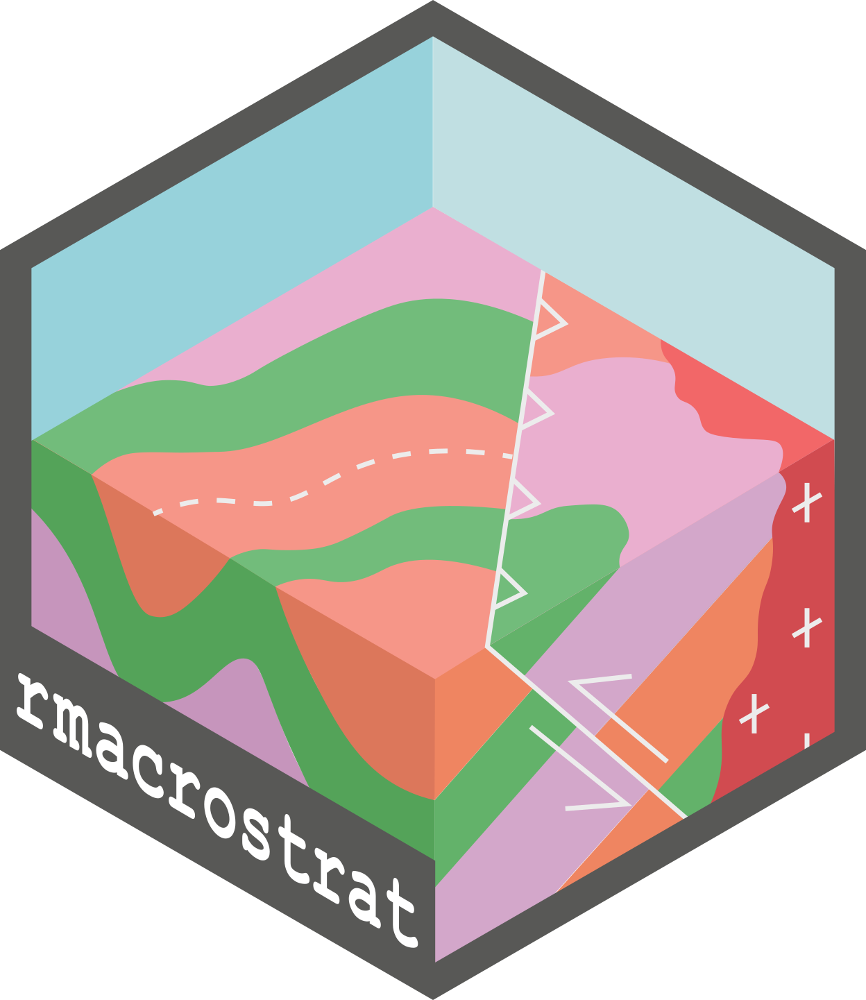
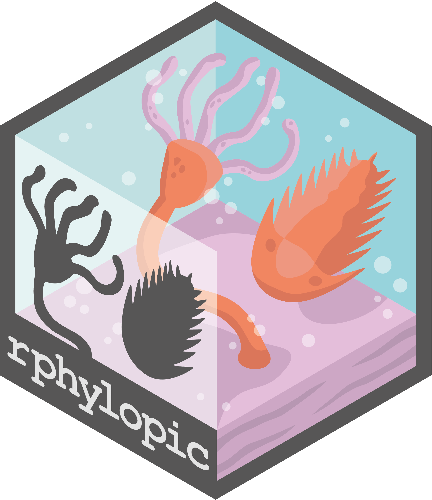

<h1>Welcome to Palaeoverse!</h1>
<h3>A Resource Hub for Palaeobiologists</h3>
  

[Palaeoverse](https://palaeoverse.org) is an initiative which aims to bring the palaeobiology community together to share resources, reach agreed standards, and improve reproducibility in palaeobiological research. We provide **R Packages** for data preparation, exploration, and visualisation. Software development is currently led by a community of [early career researchers](https://palaeoverse.org/about#our-team). We are passionate about improving code readability, reproducibility, and accessibility in palaeobiology. If you are interested in getting involved in Palaeoverse, [get in contact](mailto:LewisA.Jones@outlook.com)! 👋

All our code is, and will always be, **free and open-source**. <ins>We don't do barriers</ins>. 🔓

## Our toolkits

  
  
  
  

- [palaeoverse](https://palaeoverse.palaeoverse.org): palaeoverse provides functionality to support data preparation and exploration for palaeobiological analyses, improving code reproducibility and accessibility. The aim of the palaeoverse R package is to bring the palaeobiological community together to establish agreed standards.  

- [rmacrostrat](https://rmacrostrat.palaeoverse.org): rmacrostrat provides functionality to work with the Macrostrat Web Service (<https://macrostrat.org/>) to fetch geological data relevant to the spatial and temporal distribution of sedimentary, igneous, and metamorphic rocks as well as data extracted from them.  

- [rphylopic](https://rphylopic.palaeoverse.org): rphylopic allows users to add silhouettes of organisms from the PhyloPic website to plots generated in base R and ggplot2. rphylopic was originally developed and maintained by <a href="https://scottchamberlain.info" style="text-decoration: none">Scott Chamberlain</a>. From ver. 1.0.0, the package is now developed and maintained by the Palaeoverse team.  

- [sepkoski](https://sepkoski.palaeoverse.org): sepkoski provides access to Sepkoski's fossil marine animal genera compendium (Sepkoski, 2002). The aim of the package is to offer a light and easily-accessible solution to working with Sepkoski's compendium to support teaching exercises.  

